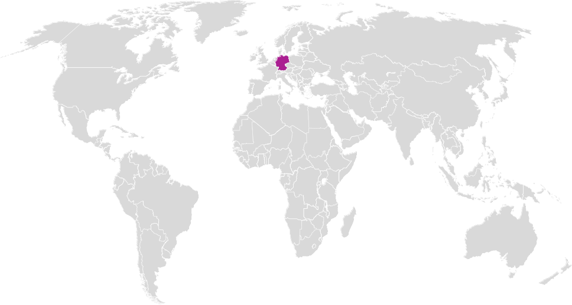
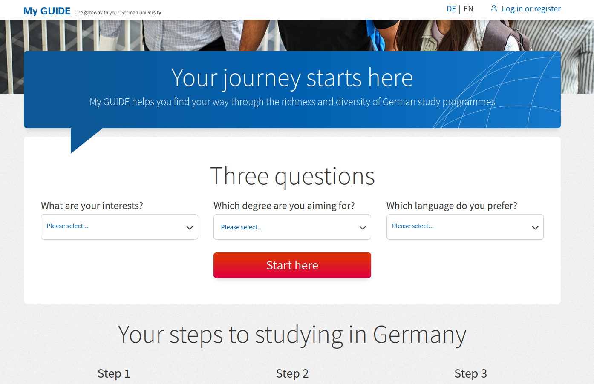
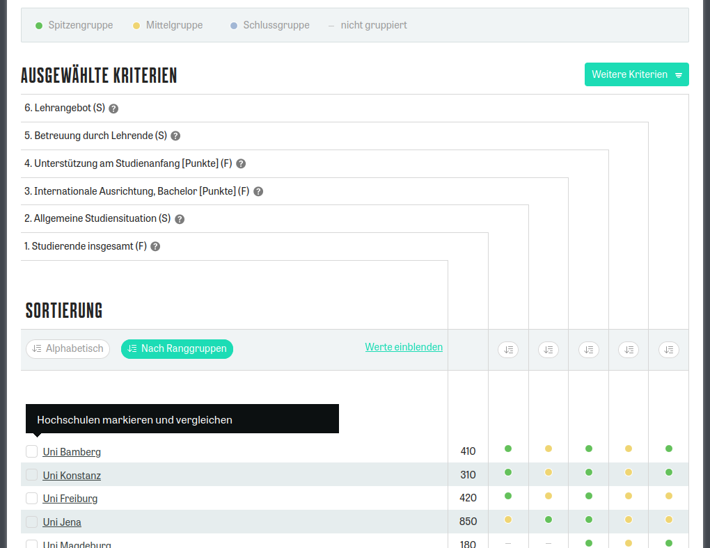
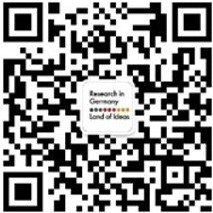
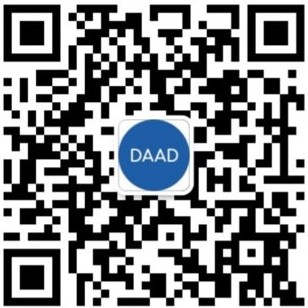
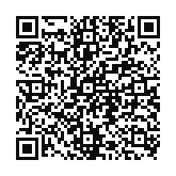
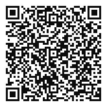
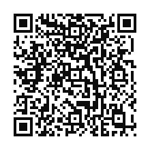

```{r setup, include=FALSE}
knitr::opts_chunk$set(echo = FALSE, message = FALSE)
```

# Fakten über Deutschland

## Deutsche Entdeckungen und Erfindungen

::: {layout-ncol=3}

























:::


## Deutsche Marken

## Wo ist Deutschland?



# Studieren in DE! 留学德国

## Weltweit beliebter Studienort


## Studieren in DE! 留学德国 {.smaller}


## Wieso Deutschland? 去德国留学的理由

<center>
#### Hohe Qualität, guter Ruf<br>世界知名的高学术水平 {.fade-in-then-semi-out}

#### Viele Programme und Studienfächer<br>丰富多彩的课程和专业可供选择 {.fade-in-then-semi-out}

#### Starke Verknüpfung von Theorie und Praxis<br>理论与实践的紧密联系，利好的工作政策 {.fade-in-then-semi-out}

#### Kulturelles Leben, interkulturelles Flair<br>悠久的文化底蕴，独特的国际文化氛围 {.fade-in-then-semi-out}

#### Ein sicheres und wirtschaftlich stabiles Land<br>安全和经济稳定的地方 {.fade-in-then-semi-out}

#### 18 Monate Arbeitssuche-Visum<br>毕业后有充分的时间在德国找工作（18个月) {.fade-in-then-semi-out}

#### Niedrige Kosten<br>学习费用低廉 {.fade-in-then-semi-out}
</center>


## Das deutsche Hochschulsystem 德国大学体系

:::: {.columns}
::: {.column width='45%'}
](material/karte_hochschulen.png){width='600px'}
:::
::: {.column width='53%' .incremental}

#### 122 Universitäten<br>122综合大学

#### 201 Fachhochschulen<br>201应用科学大学

#### 57 Kunst- und Musik-Hochschulen<br>57艺术学院和音乐学院

#### 120 Private Hochschulen<br>120私立大学和学院

:::
::::

## Studieren in DE! 留学德国 {.smaller}

|**Universität**|  |  |
|--|------|------|
|Fächer<br>课程设置|Viele Fächer, verschiedene Fachgebiete, z.B. DaF, Germanistik, Maschinenbau, Kunst, Jura, BWL, Soziologie, Theologie, Medizin, ...|学科较多、专业齐全，包外国德语，德语语言文学，工科，理科，文科，法学，经济学，社会学，神学，医学，。。。|
|Abschluss<br>毕业学位|Bachelor (3-4 Jahre)<br>Master (+2 Jahre)<br>Promotion (+3-5 Jahre)|本科（3-4 年)<br>硕士（+2 年<br>博士（+3-5 年）|
|Schwerpunkt<br>重点|Akademische Forschung und Lehre|科研与教学并重，强调基础研究和理论知识系统化|

## Studieren in DE! 留学德国 {.smaller}

|**Fachhochschule**|  |  |
|--|------|------|
|Fächer<br>课程设置|Bestimmte Fächer, vor allem Maschinenbau, BWL, Design, Krankenpflege, keine Geisteswissenschaften|一般只设有几个专业，但特色极为突出，如工程学，商科，管理，社会学，设计等|
|Abschluss<br>毕业学位|Bachelor (3-4 Jahre)<br>Master (+2 Jahre)|本科（3-4 年)<br>硕士（+2 年）|
|Schwerpunkt<br>重点|Angewandte Forschung, praktischer|除掌握必要的基础理论外，强调与实践的高度结合|

## Mein Weg von China nach DE {.smaller}

:::: {.columns}
::: {.column style='text-align: center; width:48%;'}
**Vor dem Bachelor**

Mindestens ein Semester an "211" Universität studieren<br>
至少在国内重点大学就读一个学期

&darr;

APS + Sprachprüfungen<br>
APS + 一定的语言要求

&darr;

Bachelor-Studium in DE<br>
进入德国大学本科学习

:::

::: {.column style='text-align: center; width:48%;'}
**Nach dem Bachelor**

Bachelor von anerkannter Universität in China<br>
至少在国内普通高校就读满三个学期

&darr;

APS + Sprachprüfungen<br>
APS + 一定的语言要求

&darr;

Master-Studium in DE<br>
进入硕士阶段

:::
::::

::: {style='text-align: center; margin-top: 50px;'}
**Nach dem Master** &rarr; Promotion in DE
:::

## APS {.smaller}

**Akademische Prüfstelle 德国驻华使馆文化处留德人员审核部**

[www.aps.org.cn](www.aps.org.cn)

:::{.incremental}
* Deutsche Botschaft Beijing<br>
德国驻华使馆文化处提供的服务
* Evaluation akademischer Zeugnisse usw.<br>
评估学生的大学成绩，审核他的能力
* Interview (Deutsch oder Englisch)<br>
面谈（德/英)
* Kosten: RMB 2.500<br>
费用：2500元人民币
* Zertifikat – Visa-Eil-Verfahren<br>
证书——能更快拿到签证
:::

## Sprachprüfungen {.smaller}


::: 

**TestDaF 德福考试**

[https://www.testdaf.de/](https://www.testdaf.de/de/teilnehmende/mein-testdaf/pruefungsteilnehmende-in-china/)

|TestDaF-Institut|德福考试院|
|---|-----|
|12 Universitäten in China|中国目前有12个考点|
|3/Jahr: März, Juli, November|中国地区每年 3次考试，分别在 3月，7月和 11月|

:::

::: 

**DSH**

[http://dsh.de/](http://dsh.de/)

|Jede Universität|各个大学|
|---|---|
|Prüfungsort wird von Uni bestimmt|以德国大学的信息为准|
|Prüfungszeit wird von Uni bestimmt|以德国大学的信息为准|

:::

## Was soll ich studieren? {.smaller}

[https://www.myguide.de/en/](https://www.myguide.de/en/)



## Wo soll ich studieren?

[https://ranking.zeit.de/che/de/](https://ranking.zeit.de/che/de/)

\centering
\includegraphics[height=6cm]{./material/che-ranking.png}

## Wo soll ich studieren?

**Registieren** &rarr; **Fach wählen** &rarr; **Hochschulart wählen**:



## Geld 钱 {.smaller}

### Wieviel kostet das? 在德国的生活和学习费用

::::: columns
::: {.column width="48%"}
**Einmalige Kosten vor der Ausreise**

|              |                |
|--------------|----------------|
| APS-Gebühren | 2.000 RMB      |
| Rundflug     | 10.000 RMB     |
| **Gesamt**   | **12.000 RMB** |
:::

::: {.column width="48%"}
**Monatliche Kosten in Würzburg**

|              |        |               |
|--------------|--------|---------------|
| Essen        | 250 EU | 1.970 RMB     |
| Wohnen       | 350 EU | 2.755 RMB     |
| Versicherung | 110 EU | 866 RMB       |
| Sonstiges    | 230 EU | 1.810 RMB     |
| **Gesamt**   | 940 EU | **7.401 RMB** |
:::
:::::

<br>


### DAAD Stipendiendatenbank 奖学金数据库

<center>


[https://www.daad.org.cn/zh/find-funding/scholarship-database/](https://www.daad.org.cn/zh/find-funding/scholarship-database/)

</center>

**Nur wenige Stipendien für Nicht-Graduierte**<br>
**本科生的奖学金明显较少。**


## Zeitplan {.smaller}

**Beginnen Sie frühzeitig zu planen!** [Zeitplan auf Chinesisch](material/zeitplan-chinesisch.png){target="_blank"}

::: {.panel-tabset}

## Zeitplan


|Schritte in China|WS|SS|
|------|---|---|
|1. TestDaF ablegen|März|Nov|
|2. Uni wählen und Voraussetzungen recherchieren|Juli--Okt|Jan--April|
|3. Unterlagen vorbereiten, übersetzen, beglaubigen|Juli--Okt|Jan--April|
|4. APS|Okt--Feb|April--Aug|
|5. Bei Uni bewerben|März--Juli|Sep--Jan|
|6. Sperrkonto einrichten|Jul--Aug|Dez--Jan|
|7. Visum beantragen|Aug--Sept|Jan--Feb|
|8. Flugticket buchen, Wohnung suchen|Okt|März|
|9. Bei Uni einschreiben|Okt|April|

## 时间表

Here is the translated Markdown table from German to Chinese:

| 在中国的步骤 | WS | SS |
|--------------|-------|-------|
|1.参加TestDaF考试 | 三月 | 十一月 |
|2.选择大学并研究入学要求 | 七月--十月 | 一月--四月 |
|3. 准备文件，翻译，公证 | 七月--十月 | 一月--四月 |
|4. APS | 十月--二月 | 四月--八月 |
|5. 向大学申请 | 三月--七月 | 九月--一月 |
|6. 开设冻结账户 | 七月--八月 | 十二月--一月 |
|7.申请签证 | 八月--九月 | 一月--二月 |
|8.订机票，找住所 | 十月 | 三月 |
|9. 在大学注册 | 十月 | 四月 |

:::

## uni-assist {.smaller}

Bewerbungshilfe für internationale Studierende<br>外国学生申请大学服务处

[www.uni-assist.de](www.uni-assist.de)

::: {.incremental}
* Überprüft Bewerbungsunterlagen<br>
对所有外国学生的申请材料进行核实、对入学资格进行认证
* Kosten: Erste Bewerbung EUR 75, jede weitere EUR 30<br> 
费用：第一所大学收费75欧元，之后每所大学收费30欧元
* Bewerbungen online einreichen<br> 
通过uni-assist可以在线提出申请
* Liste aller 180 uni-assist-Universitäten<br> 
近180所uni-assist大学名单请见uni-assist网站
:::

## Infos online {.smaller}

[https://www.study-in-germany.de/de/](https://www.study-in-germany.de/de/)<br>Mehrsprachige Info-Seiten vom DAAD für alle, die in Deutschland studieren wollen: Schritt-für-Schritt von Recherche bis Studienbeginn

[https://www.myguide.de/en/](https://www.myguide.de/en/)<br>
Mehrsprachige DAAD-Seite: Studienfach wählen, Voraussetzungen prüfen, Universität kontaktieren

[DAAD Stipendiendatenbank](https://www2.daad.de/deutschland/stipendium/datenbank/en/21148-scholarship-database/)<br>
Wo Sie das passende Stipendien für sich finden

[https://www.make-it-in-germany.com/de/](https://www.make-it-in-germany.com/de/)<br>
Mehrsprachiges Portal der Bundesregierung mit vielfältigen Infos zu Arbeit, Studium und Ausbildung in Deutschland.

## Promovieren in DE {.smaller}

|Research in Germany|DAAD WeChat|
|:-----:|:-----:|
|{height=150px}|{height=150px}|

||Stipendiendatenbank|
|:-----:|:-----:|
||{height=150px}|


## Studieren in DE! 留学德国 {.smaller}

**Wie DE mich verändert hat!**


## Vielen Dank für Ihre Aufmerksamkeit {.smaller}

<center>
**Slides online**

{height=150px}

**Slides downloaden**

{height=150px}
</center>
