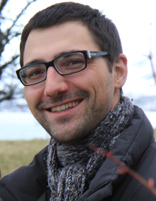

---
---

# About me  

Hi! I am Daniel. Welcome to my homepage! I trained as a cognitive quantitative linguist in Germany, the USA, and the Netherlands and spent some time researching second language acquisition. Now I work as a foreign language teacher for German in China. In my research and teaching I try to bring the linguist and the language teacher in me closer together. Some of my attempts you will find on this website. Feel free to explore.

