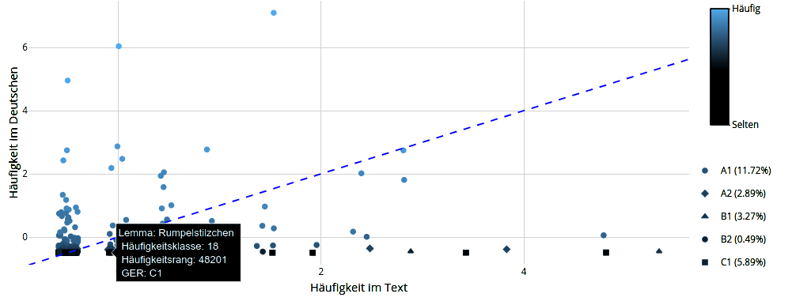

---
---

# Resources

I am more of a coding linguist than a linguistic coder. With R (R Core Team 2020), I solve linguistic problems or enhance my language teaching. As a consequence, my applications and functions all relate in one way or another to ([foreign] language) teaching and researching. For example, my QuAX-DaF tool analyzes the distribution of words in texts such as the German fairy tale *Rumpelstilzchen*, seen in the image below. 

`2020` 

<a href="https://daniel-jach.github.io/simple-german/simple-german.html" target="_blank">Corpus Simple German</a>

My Corpus Simple German is a digital collection of texts in simple German as a resource for data-driven language learning at low levels of proficiency.

<a href="https://daniel-jach.github.io/gutDeutsch-online/index.html" target="_blank">Gut Deutsch online</a>

My repository *Gut Deutsch* with activities for learning German as a foreign language online.

<a href="https://danieljach.shinyapps.io/instant-eva-deutsch/" target="_blank">InstantEva Deutsch</a> &emsp; <a href="https://github.com/daniel-jach/instant-eva-deutsch" target="_blank">Link to repository</a>

- Instant**Eva** Deutsch is an interactive online application for student course evaluations. 
- **Instant**Eva Deutsch is like instant noodles: quick, easy, and all-in-one (survey, analysis, and summary). 
- InstantEva **Deutsch** is currently only available in German. 
- Recently, the application sometimes does not load because of connectivity problems related to the COVID-19 shutdown.

<a href="https://github.com/daniel-jach/treetag-fertilizer" target="_blank">treetag.fertilizer</a>

My R function treetag.fertilizer calls a local installation of TreeTagger and identifies sentences in the parsed corpus. So what? treetag.fertilizer works much faster than similar functions.

`2019`

<a href="https://danieljach.shinyapps.io/quax-daf/" target="_blank">QuAX-DaF</a> &emsp; <a href="https://github.com/daniel-jach/quax-daf" target="_blank">Link to repository</a>

- QuAX-DaF stands for **Qu**antitative **A**nalyse von Te**X**ten für **D**eutsch **a**ls **F**remdsprache ("Quantitative Analysis of Texts for German as a Foreign Language").
- QuAX-DaF is an interactive web application that analyzes words in texts, compares their frequency distribution to German language use, and generates teaching material for exercises at specific proficiency levels.
- QuAX-DaF will be of use to teachers of German as a foreign language and developers of teaching material.

### References

R Core Team. 2020. *R: A Language and Environment for Statistical Computing*. Vienna, Austria: R Foundation for Statistical Computing. <a href="https://www.R-project.org/" target="_blank">https://www.R-project.org/</a>.