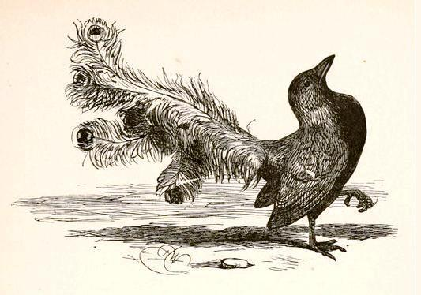

---
---

# Borrowed Plumes

Whoever said that all Chinese are good at math but bad at the arts has never met my students. They are really bad at math (Sorry, folks! You know I am just joking! ;-) but really good at original writing, critical thinking, and other creative tasks. They have allowed me to adorn my website with some of their work.

<a href="https://daniel-jach.github.io/critical-incidents">Critical Incidents</a> 

<a href="https://daniel-jach.github.io/fairy-tales">Fairy Tales</a> 

<a href="https://daniel-jach.github.io/jobinterview">The worst job interview ever</a> 