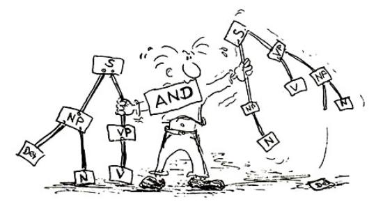

---
---

# Teaching  

### Approach

My linguistic expertise on second language learning forms the foundation of my teaching practice. My students interact with each other autonomously and in a variety of social forms to encourage usage-based and purpose-driven meaningful language learning. As their teacher, my job is to provide them with the linguistic and nonlinguistic resources they require to accomplish this goal successfully. My subject teaching is inspired by my language teaching in that I place the learners at the center of attention and promote action-based learning, as illustrated in the picture below. 

### Academic Writing Guide

Download my academic writing guide (in German) <a href="material/leitfaden-wissenschaftliches-schreiben.pdf" target="_blank">here</a>.

### Courses

Semester | Title | CEFL | Syllabus | Evaluation
-----|-----------------------------------|----|----|----
2021 | MäRchen: Text Mining mit den sieben Zwergen ("FaiRy Tales: Text Mining with the Seven Dwarfs")  | A2/B1 | <a href="material/syllabus-maerchen-2021.html" target="_blank">Syllabus</a> | <a href="material/evaluation-fairytales-2ndyear-2021-SHNU.pdf" target="_blank">Evaluation</a>
2021 | Gespräche (und verwandte Sprachspiele) in DaF ("Spoken German") | B2 | | <a href="material/evaluation-speaking-3rdyear-2021-SHNU.pdf" target="_blank">Evaluation</a> <a href="material/evaluation-speaking-3rdyear-2021-ECUST.pdf" target="_blank">Evaluation</a>
2021 | Gespräche (und verwandte Sprachspiele) in DaF ("Spoken German") | A2/B1 | | <a href="material/evaluation-speaking-2ndyear-2021-SHNU.pdf" target="_blank">Evaluation</a> 
2021 | Grundkurs DaF ("Comprehensive GFL") | A2/B1 | | <a href="material/evaluation-comprehensive-german-2ndyear-2021-SHNU.pdf" target="_blank">Evaluation</a> 
2021 | Wirtschaftsdeutsch ("Business German") | C1 | | <a href="material/evaluation-commercial-german-3rdyear-2021-ECUST.pdf" target="_blank">Evaluation</a> 
2021 | Mustergültig Schreiben in DaF ("Exemplary Writing in GFL") | B1B2 | <a href="material/syllabus-writing-2021.pdf" target="_blank">Syllabus</a> | <a href="material/evaluation-writing-2ndyear-2021-ECUST.pdf" target="_blank">Evaluation</a>
2020/21 | Bildungssprache Deutsch / TestDaF ("Academic Language German / TestDaF preparation") | B1/B2
2020/21 | Gespräche (und verwandte Sprachspiele) in DaF ("Spoken German") | A2 
2020/21 | Grundkurs DaF ("Comprehensive GFL") | B1
2020/21 | Grundkurs DaF ("Comprehensive GFL") | A2
2020/21 | Landeskunde ("Regional Studies") | B1/B2 | <a href="material/syllabus-regional-studies-2020-21.pdf" target="_blank">Syllabus</a> |<a href="material/evaluation-regional-studies-2020-21-1.pdf" target="_blank">Evaluation</a> <a href="material/evaluation-regional-studies-2020-21-2.pdf" target="_blank">Evaluation</a>
2020 | Grammatische Konstruktionen gesprochener Sprache ("Grammatical Constructions of Spoken Language") | C1 | <a href="material/syllabus-spoken-language-2020.pdf" target="_blank">Syllabus</a>  
2020 | Wissenschaftliches Schreiben für DaF ("Academic Writing for GFL") | B2 |<a href="material/syllabus-academic-writing-2020.pdf" target="_blank">Syllabus</a> | <a href="material/evaluation-academic-writing-2020.pdf" target="_blank">Evaluation</a>
2020 | Einführung in die Germanistische Sprachwissenschaft II ("Introduction to German Linguistics II") | B2 | <a href="material/syllabus-introduction-linguistics-2020.pdf" target="_blank">Syllabus</a> | <a href="material/evaluation-introduction-linguistics-2020.pdf" target="_blank">Evaluation</a>
2020 | Mustergültig Schreiben in DaF ("Exemplary Writing in GFL") | B1 | <a href="material/syllabus-writing-2020.pdf" target="_blank">Syllabus</a> | <a href="material/evaluation-writing-2020.pdf" target="_blank">Evaluation</a>
2020 | Deutsche Geschichte bis 1918 ("German History until 1918") | B1 | <a href="material/syllabus-history-2020.pdf" target="_blank">Syllabus</a> | <a href="material/evaluation-history-I-2020.pdf" target="_blank">Evaluation</a>
2020 | Interkulturelle Kommunikation ("Intercultural Communication") | B2 | <a href="material/syllabus-intercultural-communication-2020.pdf" target="_blank">Syllabus</a> | <a href="material/evaluation-intercultural-communication-2020.pdf" target="_blank">Evaluation</a>
2020 | Wirtschaftsdeutsch ("Business German") | B2 
2019/20 | Kreatives Übersetzen ("Creative Translation") | C1 | <a href="material/syllabus-translation-2019-20.pdf" target="_blank">Syllabus</a> |
2019/20 | Lesen deutscher Zeitungen und Medien ("Reading German Newspaper and Media") | B1/B2
2019/20 | Landeskunde ("Regional Studies") | A2/B1 | <a href="material/syllabus-regional-studies-2019-20.pdf" target="_blank">Syllabus</a> | 
2019/20 | Aktuelle politische Probleme ("Current Political Problems") | B2/C1 | <a href="material/syllabus-political-problems-2019-20.pdf" target="_blank">Syllabus</a> | 
2019/20 | Mustergültig Schreiben in DaF ("Exemplary Writing in GFL") | B2 | <a href="material/syllabus-writing-2019-20.pdf" target="_blank">Syllabus</a> | 
2019/20 | Deutsche Filme ("German Movies") | B2 | <a href="material/syllabus-movies-2019-20.pdf" target="_blank">Syllabus</a> | 
2019/20 | Deutsche Geschichte ab 1918 ("German History since 1918") | B2 |<a href="material/syllabus-history-2019-20.pdf" target="_blank">Syllabus</a> | 
2019/20 | Gespräche (und verwandte Sprachspiele) in DaF ("Spoken German") | A2/B1 
2019 | Cognitive English Grammar ("Kognitive Grammatik des Englischen") | | <a href="material/syllabus-cognitive-grammar-2019.pdf" target="_blank">Syllabus</a> | <a href="material/evaluation-cognitive-grammar-2019.pdf" target="_blank">Evaluation</a>
2018/19 | Second Language Acquisition ("Zweitsprachenerwerbsforschung") | | <a href="material/syllabus-second-language-acquisition-2018-19.pdf" target="_blank">Syllabus</a> | <a href="material/evaluation-second-language-acquisition-2018-19.pdf" target="_blank">Evaluation</a>
2017/18 | Introduction to English Linguistics II ("Einführung in die Anglistische Sprachwissenschaft II") | | <a href="material/syllabus-introduction-linguistics-2017-18.pdf" target="_blank">Syllabus</a> | <a href="material/evaluation-introduction-linguistics-2017-18.pdf" target="_blank">Evaluation</a>
2017/18 | Cognitive English Grammar ("Kognitive Grammatik des Englischen") | | <a href="material/syllabus-cognitive-grammar-2017-18.pdf" target="_blank">Syllabus</a> | <a href="material/evaluation-cognitive-grammar-2017-18.pdf" target="_blank">Evaluation</a>
2017 | Text and Discourse Linguistics ("Text- und Diskurslinguistik") | | <a href="material/syllabus-textlinguistics-2017.pdf" target="_blank">Syllabus</a> | <a href="material/evaluation-textlinguistics-2017.pdf" target="_blank">Evaluation</a>
2016/17 | Second Language Acquisition ("Zweitsprachenerwerbsforschung") | | <a href="material/syllabus-second-language-acquisition-2016-17.pdf" target="_blank">Syllabus</a> | <a href="material/evaluation-second-language-acquisition-2016-17.pdf" target="_blank">Evaluation</a>
2016 | Text and Discourse Linguistics ("Text- und Diskurslinguistik") | | <a href="material/syllabus-textlinguistics-2016.pdf" target="_blank">Syllabus</a> | <a href="material/evaluation-textlinguistics-2016.pdf" target="_blank">Evaluation</a>
2015/16 | Introduction to English Linguistics II ("Einführung in die Anglistische Sprachwissenschaft II") | | <a href="material/syllabus-introduction-linguistics-2015-16.pdf" target="_blank">Syllabus</a> | <a href="material/evaluation-introduction-linguistics-2015-16.pdf" target="_blank">Evaluation</a>
2015 | Text and Discourse Linguistics ("Text- und Diskurslinguistik") | | <a href="material/syllabus-textlinguistics-2015.pdf" target="_blank">Syllabus</a> | <a href="material/evaluation-textlinguistics-2015.pdf" target="_blank">Evaluation</a>
2014/15 | Text and Discourse Linguistics ("Text- und Diskurslinguistik") | | <a href="material/syllabus-textlinguistics-2014-15.pdf" target="_blank">Syllabus</a> | 
2011 | DaF für Studierende anderer Fächer ("GFL for Nonmajor Students") | A2/B1
2010/11 | DaF für Studierende anderer Fächer ("GFL for Nonmajor Students") | A2  
2010 | Tutorien Einführung in die Germanistische Sprachwissenschaft ("Tutorials for Introduction to German Linguistics")
